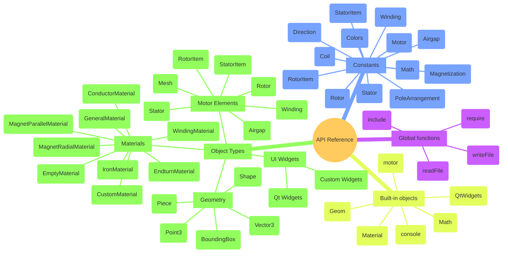

# Ментальная карта MotorXP-AFM Scripting API

```mermaid
%%{
  init: {
    'theme': 'base'
  }
}%%
mindmap
    root((API Reference))
        Global functions[Global functions]
            include(include)
            require(require)
            writeFile(writeFile)
            readFile(readFile)

        Constants[Constants]
            Airgap(Airgap)
            Math(Math)
            Motor(Motor)
            Rotor(Rotor)
            Stator(Stator)
            RotorItem(RotorItem)
            StatorItem(StatorItem)
            Direction(Direction)
            Coil(Coil)
            Magnetization(Magnetization)
            PoleArrangement(PoleArrangement)
            Colors(Colors)
            Winding(Winding)
        
        Built-in objects[Built-in objects]
            Math(Math)
            Geom(Geom)
            Material(Material)
            QtWidgets(QtWidgets)
            console(console)
            motor(motor)

        Object Types[Object Types]

            Motor Elements[Motor Elements]
                Stator(Stator)
                StatorItem(StatorItem)
                Rotor(Rotor)
                RotorItem(RotorItem)
                Airgap(Airgap)
                Winding(Winding)
                Mesh(Mesh)

            Geometry[Geometry]
                Point3(Point3)
                Vector3(Vector3)
                Shape(Shape)
                BoundingBox(BoundingBox)
                Piece(Piece)

            Materials[Materials]
                ConductorMaterial(ConductorMaterial)
                EmptyMaterial(EmptyMaterial)
                EndturnMaterial(EndturnMaterial)
                GeneralMaterial(GeneralMaterial)
                IronMaterial(IronMaterial)
                MagnetParallelMaterial(MagnetParallelMaterial)
                MagnetRadialMaterial(MagnetRadialMaterial)
                WindingMaterial(WindingMaterial)
                CustomMaterial(CustomMaterial)

            UI Widgets[UI Widgets]
                Qt Widgets(Qt Widgets)
                Custom Widgets(Custom Widgets)
```

