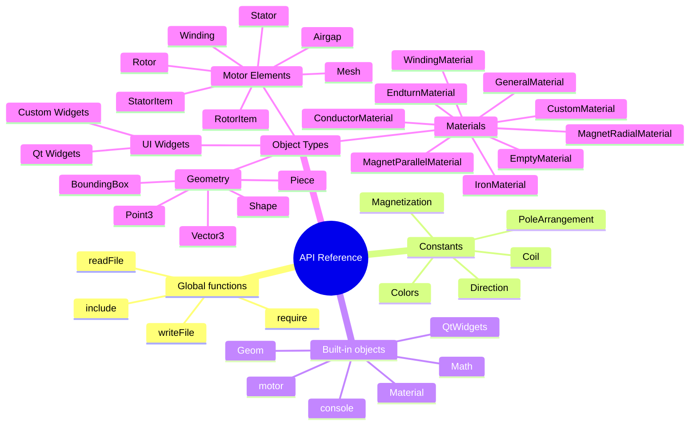

# Интеллект-карта MotorXP-AFM Scripting API

```mermaid
mindmap
    root((API Reference))
        Global functions
            include
            require
            writeFile
            readFile

        Constants
            Direction
            Coil
            Magnetization
            PoleArrangement
            Colors
        
        Built-in objects
            Math
            Geom
            Material
            QtWidgets
            console
            motor

        Object Types

            Motor Elements
                Stator
                StatorItem
                Rotor
                RotorItem
                Airgap
                Winding
                Mesh

            Geometry
                Point3
                Vector3
                Shape
                BoundingBox
                Piece

            Materials
                ConductorMaterial
                EmptyMaterial
                EndturnMaterial
                GeneralMaterial
                IronMaterial
                MagnetParallelMaterial
                MagnetRadialMaterial
                WindingMaterial
                CustomMaterial

            UI Widgets
                Qt Widgets
                Custom Widgets
```

